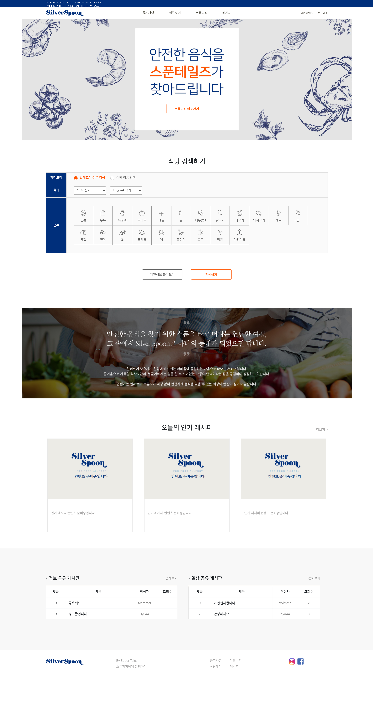

# Silverspoon 
: 식품 알레르기 보유자를 위한 커뮤니티와 음식점 필터링 웹서비스

- Ruby 2.4.0 / Rails 5.2.1 (sqlite3 -active record) 
  + need aws key in application.yml 
  + install imagemagick on Ubuntu 

### 주요 기능
  - <b>식당 및 메뉴 불러오기</b> 
    - 웹크롤링, csv파일 import / 메뉴 filter
  - <b>알레르기 성분 필터링 기능</b>
    - 알레르기 성분 검색 : 알레르기 성분을 입력하면 해당 성분이 들어가지 않은 메뉴(메뉴와 식당정보)를 알 수 있다.
    - 식당 이름 검색 : 가고자 하는 식당의 알러지정보를 알 수 있다.
   - <b>커뮤니티 기능</b>
     - 알레르기 보유자들의 소통 및 정보공유 공간
     - 회원가입 및 로그인, 관리자기능 (베타버전 소셜로그인기능 삭제) / 프로필 및 쪽지
     - 게시판 글작성, 댓글관리

### 메인 페이지

##### 기타 관련 활동
- 2018.08 멋쟁이사자처럼 중앙 아이디어톤, 해커톤
- 2018.12 SEED SCHOOL for Challenger 교육
